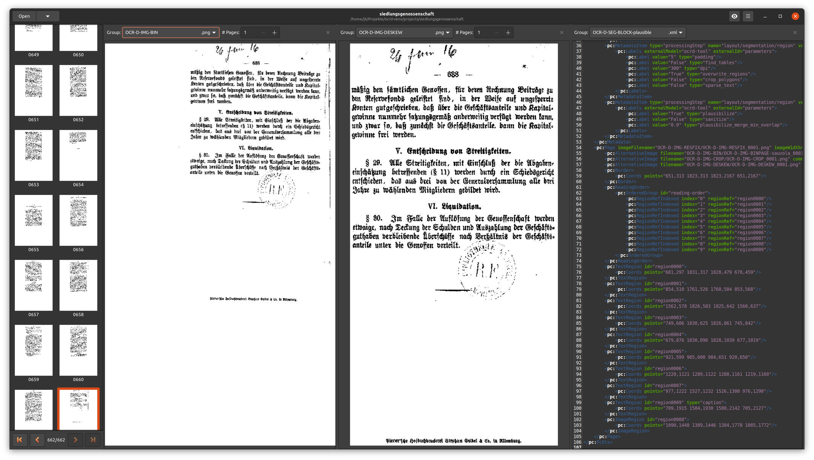

[](https://github.com/hnesk/browse-ocrd/actions/workflows/unittest.yml)
[](https://github.com/hnesk/browse-ocrd/actions/workflows/dockerhub.yml)

# OCR-D Browser

An extensible viewer for [OCR-D](https://ocr-d.de/) [mets.xml](https://ocr-d.de/en/spec/mets) files

 * [Screenshot](#screenshot)
 * [Features](#features)
 * [Installation](#installation)
    * [Native](#native-tested-on-ubuntu-18042004)
       * [From source](#from-source)
       * [Via pip](#via-pip)
    * [Docker](#docker)
 * [Usage](#usage)
    * [Native GUI](#native-gui)
    * [Docker service](#docker-service)
 * [Configuration](#configuration)
    * [Configuration file locations](#configuration-file-locations)
    * [Configuration file syntax](#configuration-file-syntax)
 
## Screenshot




## Features

- Browse fileGrps and pages, arranging views next to each other for comparison
- PageView: Show original or derived page images with [PAGE-XML](https://ocr-d.de/en/spec/page) annotations overlay, similar to [PageViewer](https://github.com/PRImA-Research-Lab/prima-page-viewer)
- ImageView: Show original or derived images (`AlternativeImage` on any level of the structural hierarchy)
- ImageView: Show multiple images at once for different pages (horizontally) or different segments (vertically), zooming freely
- XmlView: Show raw [PAGE-XML](https://ocr-d.de/en/spec/page) with syntax highlighting, open with [PageViewer](https://github.com/PRImA-Research-Lab/prima-page-viewer)
- TextView: Show concatenated [PAGE-XML](https://ocr-d.de/en/spec/page) text annotation
- DiffView: Show a simple diff comparison between text annotations from different fileGrps  
- HtmlView: Show rendered HTML comparison from [dinglehopper](https://github.com/qurator-spk/dinglehopper) evaluations

## Installation

### Native (tested on Ubuntu 18.04/20.04) 

The native installation requires [GTK 3](https://www.gtk.org/).

In any case you need a [virtual environment](https://packaging.python.org/tutorials/installing-packages/#creating-virtual-environments) with a current `pip` version (>=20), preferably your existing OCR-D venv:

<details>
  <summary>Create a current pip venv:</summary>

```bash
sudo apt install python3-pip python3-venv 
python3 -m venv venv
source venv/bin/activate
pip install --upgrade pip setuptools wheel
```
</details>


#### From source
```bash
git clone https://github.com/hnesk/browse-ocrd.git 
cd browse-ocrd
sudo make deps-ubuntu
make install
```

#### Via pip

```bash
sudo apt install libcairo2-dev libgirepository1.0-dev
pip install browse-ocrd
```

### Docker

If you have installed [Docker](https://docs.docker.com/get-docker/), you can build OCR-D Browser as a **web service**:

    docker build -t ocrd_browser .

Or use a prebuilt image from Dockerhub:

    docker pull hnesk/ocrd_browser


## Usage

### Native GUI
Start the app with the filesystem path to the METS file of your [OCR-D workspace](https://ocr-d.de/en/spec/glossary#workspace):
```
browse-ocrd ./path/to/mets.xml
```

You can still open another METS file from the UI though.

### Docker service

When running the webservice, you need to pass a directory `DATADIR` which (recursively) contains all the workspaces you want to serve.
The top entrypoint `http://localhost/` will show an index page with a link `http://localhost/browse/...` for each workspace path.
Each link will run `browse-ocrd` at that workspace in the background, and then redirect your browser to the internal [Broadway server](https://docs.gtk.org/gtk3/broadway.html), which renders the app in the web browser.

To start up, just do:

    docker run -it --rm -v DATADIR:/data -p 8085:8085 -p 8080:8080 ocrd_browser


## Configuration

### Configuration file locations

At startup the following directories a searched for a config file named `ocrd-browser.conf` 

```python
# directories and their default values under Ubuntu 20.04
GLib.get_system_config_dirs()  # '/etc/xdg/xdg-ubuntu/ocrd-browser.conf', '/etc/xdg/ocrd-browser.conf'
GLib.get_user_config_dir()     # '/home/jk/.config/ocrd-browser.conf'  
os.getcwd()                    # './ocrd-browser.conf'
```

### Configuration file syntax

The `ocrd-browser.conf` file is an ini-file with the following keys:
```ini
[FileGroups]
# Preferred fileGrp names for thumbnail display in the Page Browser 
# Comma separated list of regular expressions
preferredImages = OCR-D-IMG, OCR-D-IMG.*, ORIGINAL

# Each Tool has a section header [Tool XYZ]
# At the moment the only defined tool is "PageViewer"  
[Tool PageViewer]
# shell commandline to execute with placeholders  
commandline = /usr/bin/java -jar /home/jk/bin/JPageViewer/JPageViewer.jar --resolve-dir {workspace.directory} {file.path.absolute}
```

The `commandline` string will be used as a python format string with the keyword arguments:

* `workspace` : The current `ocrd.Workspace`, all properties get shell escaped (by `shlex.quote`) automatically.
* `file` : The current `ocrd_models.OcrdFile`, all properties get shell escaped (by `shlex.quote`) automatically, also there is an additional property `path` with the properties `absolute` and `relative`, so `{file.path.absolute}` will be replaced by the shell quoted absolute path of the file. 

> Note: You can get PRImA's PageViewer at [Github](https://github.com/PRImA-Research-Lab/prima-page-viewer/releases).
